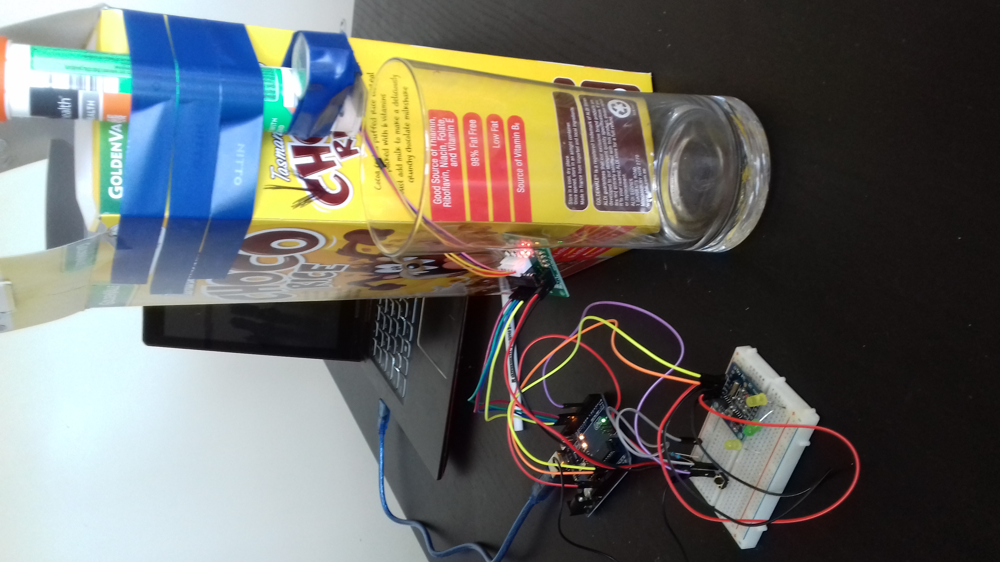

### ArduinoVitaminAlarmClock

Finally got around to trying out my arduino board. 
Uses a realtime clock to activate a stepper motor at a set time each day.  
When the motor is activated it drops an effervescent vitamin tablet into a waiting glass of water. 
Might consider adding a solenoid to automatically fill the glass of water too. 
